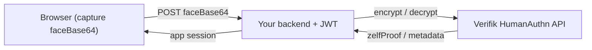

# Integration examples

Reference examples for dropping `humanauthn-nodejs-sdk`
([`@zelf/humanauthn`](https://jsr.io/@zelf/humanauthn)) into an existing app.
They are illustrative snippets (not compiled by the SDK build) and keep the
Verifik JWT server-side.

| Example | What it shows |
| --- | --- |
| [express/](express) | Express `enroll` + `authenticate` routes |
| [nextjs/](nextjs) | Next.js App Router route handlers |
| [browser/](browser) | Capture `faceBase64` from a webcam and POST it |

Typical flow:

You need a Verifik client JWT in `VERIFIK_CLIENT_JWT` — see the repo root
[Authentication](../../README.md#authentication-verifik-jwt) section.
